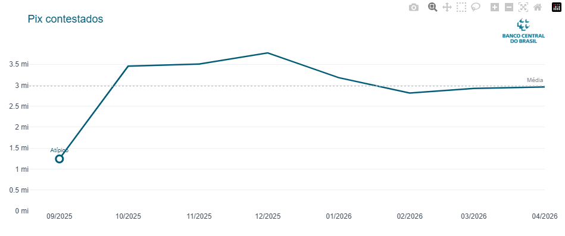
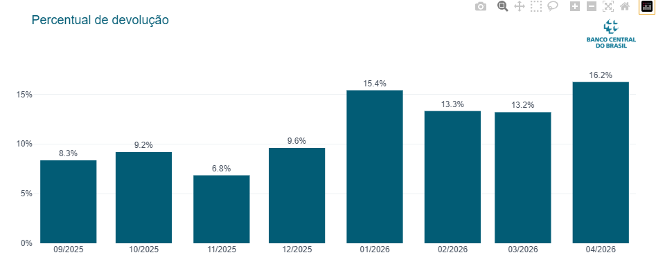

<div align="center">


<br><br>


<br>


<br><br>

# Detecção de Anomalias em Contestações Pix

### Análise de dados públicos do Banco Central do Brasil

Análise exploratória da evolução mensal das contestações Pix e do percentual de devolução, com identificação estatística de períodos fora do comportamento esperado.

</div>

---

## Problema

O volume de contestações é um indicador relevante para acompanhar mudanças no comportamento de risco do Pix.

Desvios em relação ao padrão histórico podem estar associados a mudanças no volume reportado de golpes e fraudes, no acesso aos mecanismos de contestação ou no próprio processo operacional.

Identificar esses períodos ajuda a direcionar a investigação para onde há maior necessidade de análise. Um mês atípico não comprova fraude: ele indica **onde investigar**.

## O que faz

- Consome dados públicos da API `EstatisticasFraudesPix`
- Organiza os dados em uma série mensal
- Analisa a quantidade de Pix contestados
- Calcula média e desvio-padrão da série
- Identifica meses fora do intervalo `média ± 2 desvios-padrão`
- Analisa a evolução do percentual de devolução
- Gera visualizações interativas com Plotly durante a execução
- Exibe no console os meses analisados e os períodos identificados como atípicos

## Insight principal

**Setembro/2025 foi identificado como mês atípico**, com **1,24 milhão de contestações**, aproximadamente **58% abaixo da média do período, de 2,98 milhões**.

A partir de outubro/2025, o volume mensal permaneceu entre **2,8 e 3,8 milhões de contestações**, em um patamar consistentemente superior ao observado em setembro.

Em **1º de outubro de 2025**, passou a ser obrigatório o autoatendimento do Mecanismo Especial de Devolução (MED), conhecido como **botão de contestação do Pix**, permitindo registrar contestações por fraude, golpe ou coerção diretamente pelo aplicativo da instituição financeira, sem necessidade de atendimento humano.

Uma hipótese plausível é que a redução da fricção no processo tenha facilitado o registro de contestações a partir de outubro. Nesse cenário, parte do aumento observado pode refletir **maior acessibilidade ao mecanismo de contestação**, e não necessariamente um crescimento proporcional na ocorrência de fraudes.

A coincidência temporal, porém, **não comprova causalidade**. A análise não permite isolar o efeito da mudança de outros fatores.

## Visualizações

### Pix contestados

A série temporal mostra a evolução mensal das contestações. A linha pontilhada representa a média do período e o marcador destaca observações estatisticamente atípicas.



### Percentual de devolução

O percentual de devolução complementa a análise ao mostrar a evolução da recuperação dos valores contestados.



> As imagens acima são versões estáticas para visualização no GitHub. Ao executar o script, os gráficos são exibidos de forma interativa com Plotly.

## Tecnologias

Python · pandas · requests · Plotly · API do Banco Central do Brasil

## Como rodar

```bash
pip install pandas requests plotly
python src/pix_anomaly_detection.py
```

## Fonte dos dados

[Banco Central do Brasil — Dados Abertos Pix](https://olinda.bcb.gov.br/olinda/servico/Pix_DadosAbertos/versao/v1/odata/)

API utilizada: `EstatisticasFraudesPix`


[LinkedIn](https://www.linkedin.com/in/ezequielgomesrocha/)

---

<sub>Projeto independente desenvolvido para análise de dados e portfólio. Não possui vínculo oficial com o Banco Central do Brasil.</sub>
